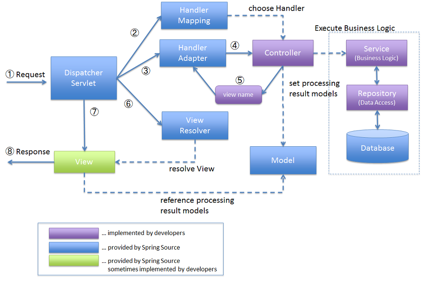

# 1일차 정리

  

## 1. cmder(item2) 다운로드 및 설치
- cmder(item2) 다운로드 및 설치
- 저장 위치: c:/dev

    

## 2. Git & GitHub 설치 및 연동
- Git 다운로드 및 설치
- 환경 변수 추가 확인
- GitHub Repository 생성: Repository name 입력 / ex) sch-2025
- 토큰 발행

    

## 3. Git 명령어
- **사용자 확인 및 설정**: git config --global user.name "[사용자명]"     

- **이메일 확인 및 설정(잔디)**: git config --global user.email "[메일주소]"     
- **GitHub Repository Clone**

	: git clone https://[토큰번호]@github.com/[GitHub ID]/[Repository name].git     

- **Stage add**: git add [파일명 or .(전체)]     

- **Commit(Local Repository add)**: git commit -m "[commit message]"

	-> GitHub(X) / Repository(O)     

- **Push(GitHub Remote Repository push)**: git push origin main

	-> GitHub(o)

    

## 4. JDK 다운로드 및 설치
- SpringBoot 사용: JDK 17 이상 설치
- 위치: 기본 폴더
- 설치 확인 명령어: java -version

    

## 5. IntellJ 다운로드 및 설치
- community: 30일 무료 버전
	- SpringBoot Initializer 모듈 X => star.spring.io 사이트에서 SpringBoot 프로젝트 생성

    

## 6. SpringBoot 프로젝트 생성 및 실행
- start.spring.io 사이트에서 SpringBoot 프로젝트 생성
- 클릭: IntelliJ -> open -> 프로젝트 import
- 실행: 프로젝트 -> src -> main -> java -> SpringbootApplication 클래스의 main 메소드 실행(녹색 버튼)

    

## 7. 스프링 구조 : mvc 패턴

    

## 8. 채원
### &nbsp; 1) Git 명령어
#### &emsp; (1) 파일
- **파일 생성 및 덮어쓰기**: echo "[출력문]" > [파일명]
- **파일 내용 출력**: cat [파일명]

#### &emsp; (2) 삭제(Git push 꼭)
&emsp;&emsp; : cd.. -> ls -> rm -f sch-2025 -> exit

  

### &nbsp; 2) 브라우저 -> 서버 데이터 전송 방식
- Get
- Post

